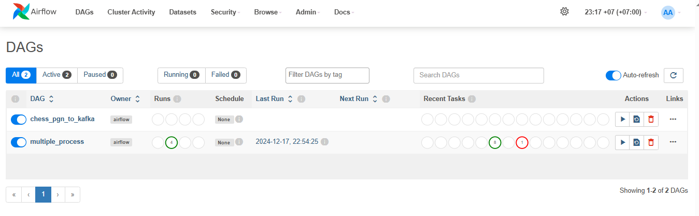
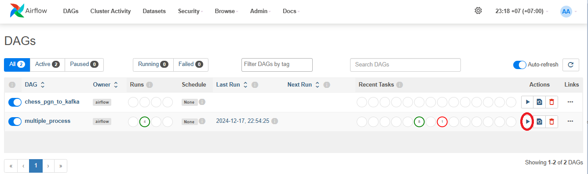

# Lichess-BigData-Processing

## *Mô tả dự án*

Dự án này xây dựng một pipeline dữ liệu xử lý dữ liệu đầu vào từ dataset trên web thực hiện airflow process, send data đến kafka-broker, qua spark và lưu vào cassandra:
1. **Airflow**: Thực hiện 2 task: process và send to kafka
2. **Kafka+Spark+Cassandra**: Kafka nhận các message, rồi spark tiếp nhận rồi chuyển vào cassandra
3. **Khả năng chịu lỗi**: Test khả năng chịu lỗi với multi-broker kafka và lỗi khi send-data đến kafka của airflow

## **Kiến trúc hệ thống**
### **1. Airflow**
- Chia data thành nhiều chunks và thực hiện xử lý song song và gửi đến kafka thông qua process_task và send_data_task qua topic `chess-games` đến multi-broker kafka
- Thực hiện xử lý fault tolerance với `retry_task` nếu có kafka-broker chết(bị tắt)
### **2. Kafka+Spark+Cassandra**
- Gồm 3 kafka-broker với các cổng 9093, 9094, 9095 giúp tăng khả năng chịu lỗi
- Spark sẽ tiếp nhận data từ kafka và lưu vào casandra

## **Hướng dẫn cài đặt**
### **1. Thực hiện clone repository**
- git clone https://github.com/khued200/Lichess-BigData-Processing.git
### **2. Cài đặt các dependency**
```bash
pip install -r requirements.txt
```
### **3. Cài đặt các docker iumage và chạy container**
```bash
docker-compose up -d
```
- Đợi cho docker pull các image, khởi động các container và cài đặt cần thiết

### **4. Truy cập localhost:8080 để vào webserver của airflow**

- Bấm chạy multiple_process để thực hiện chạy các task song song



### **5. Chạy spark để lưu dữ liệu vào Cassandra**
```bash
python .\data\spark\app.py 
...
Spark connection created successfully!
kafka dataframe created successfully
Keyspace created successfully!
Table created successfully!
Streaming is being started...
```

### **6. Kiểm tra dữ liệu trong Cassandra**
```bash
docker exec -it cassandra-lichess cqlsh
```

```bash
cqlsh> select count(*) from chess_keyspace.chess_game ;
cqlsh> select * from chess_keyspace.chess_game ;
```

## **Cài đặt custom**
### **1. Thay đổi file dữ liệu**
- Thay đổi file dữ liệu xử lý tại 
```bash
scheduler
    ...
    volumes:
        ...
        - ./lichess-database/lichess_db_chess960_rated_2024-09.pgn:/opt/airflow/lichess_db_chess960_rated_2024-09.pgn
```
### **2. Thay đổi số lượng task chạy song song**
```bash
cd data/airflow/dags/kafka_multiple.py
```
chỉnh sửa `num_games`, `num_parallel_task`để thay đổi số lượng task và số lượng data

### **3. Test khả năng chịu lỗi**
- `TH1`: Hoàn thành chạy dag trong airflow, tắt container kafka-1(hoặc kafka-2, kafka-3) trước khi chạy spark, kiểm tra số lượng data trong cassandra
- `TH2`: Tắt container kafka trong lúc task send_data đang được chạy.
- `TH3`: Tắt container kafka trước khi dag được chạy.